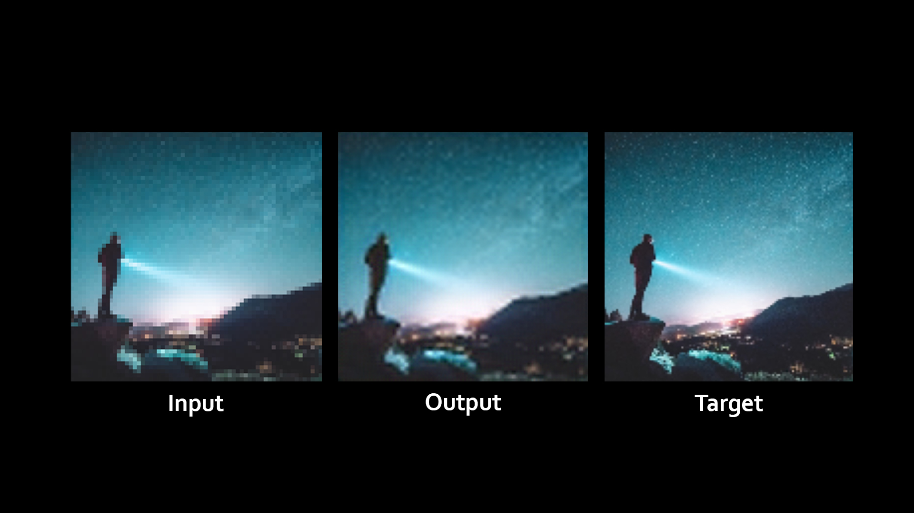
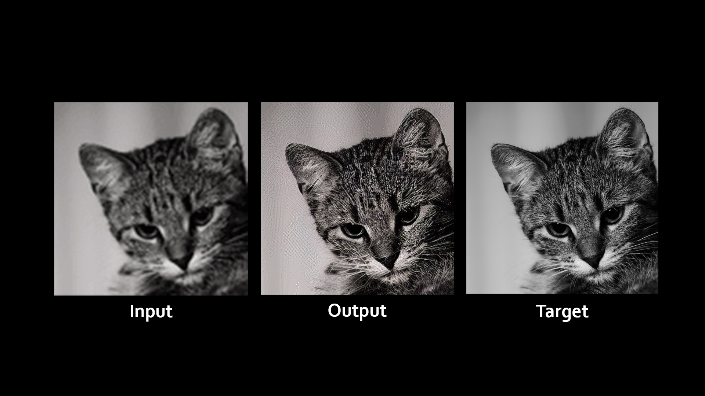

# Image Upscaler
#### Image Upscaler is a web app that uses SRCNN and SRGAN models to increase the resolution of your low resolution images without losing quality.  

This repository contains the backend for Image Upscaler created using FastAPI and the **SRCNN** and **SRGAN** models created using PyTorch.

#### 🔗 [Frontend Github repository](https://github.com/vedantyadu/imageupscaler-model-frontend)  

## Dataset
[**Flickr Image dataset**](https://www.kaggle.com/datasets/hsankesara/flickr-image-dataset) was used for training and testing the model.

## Screenshot
### SRCNN
   

The SRCNN model can be found at `/model/SRCNN.ipynb`

### SRGAN


The SRGAN model was provided by [Xintao (Github)](https://github.com/xinntao).  
#### 🔗 [Github repository](https://github.com/xinntao/Real-ESRGAN)

## Getting started
### Installing dependencies
```bash
pip install -r requirements.txt
```
### Starting the server
```bash
python main.py
```
